# Rapport Deep Learning - Projet Final

Auteurs : Clément Étoré et Louis Moreau

## 1. Le dataset

Le dataset Radar_Trafic_Counts récupéré sur [Kaggle](https://www.kaggle.com/vinayshanbhag/radar-traffic-data) est composé des données de traffic de **23** routes de la ville d'Austin. Afin d'être certains de réaliser des prédictions cohérentes, nous devons étudier, comprendre, et vérifier la cohérence de notre dataset.

### 1.1. Première approche géographique

Nous avons d'abord réalisé une approche géographique du problème afin d'observer d'éventuelles corrélations entre les routes afin de savoir si le facteur géographique était un axe à ne surtout pas négliger au cours de nos recherches.

Grâce aux latitudes et longitudes données dans le dataset, nous avons pu, dans un premier temps, afficher le trafic de chaque route toutes les semaines de l'année 2018.

<center>
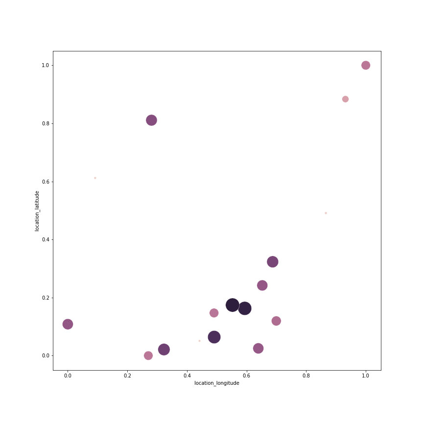
</center>

Cette interprétation graphique, nous a aidé à mieux prendre en main le dataset et en avoir une vision plus globale.

### 1.2. À quelle échelle travailler ?

Une grande étape de nos recherches a été le choix de l'échelle à laquelle nos devions travailler. Souhaitions-nous faire de la prédiction tous les **quarts d'heures**, toutes les **heures**, tous les **jours** ou tous les **mois** ?

De plus, étant donné qu'il existe **5** types de directions différentes (None, NB, SB, EB, WB), faut-il prédire le traffic pour chacune de ces directions ou faire le choix de toutes les confondres ? En effet les directions ne représentent peut être pas des routes à sens contraire mais des voies ou des orientations de routes et n'ont donc peut être pas tant intérêt à être prises en compte. En ce sens, nous avons décider de ne pas prendre en compte les directions et de sommer le traffic de chacune de celles-ci pour considérer le traffic routier global à un instant donné.

Pour l'échelle, nous avons commencé par remarquer que le dataset était composé de nombreux trous de données. Il existe des heures pour lesquelles aucune mesures ne sont données. Pour certaines routes, il existe parfois même des plages de plusieurs jours voire plusieurs mois complétement vides.

Il va alors falloir changer ces données, les retravailler afin de compléter une première fois, naivement, les données manquantes, en espérant bien entrainer notre réseau et y revenir à posteriori. Nous ne pouvons nous permettre de compléter les jours manquants aveuglément par des moyennes des jours précédents ou suivants car si ces jours en questions ne sont pas complets de données et qu'il manquent certaines données de radars, les données seront faussées.

### 1.3. Moyenne du trafic journalier par route

Nous avons décidé d'axer notre étude sur le traffic moyen observé par les radars par jour et par route. Il est important de noter qu'il ne s'agit pas de la somme des véhicules detectés par jour mais de la moyenne journalière du traffic observé toutes les 15 minutes sur une route donnée.

Nous évitons ainsi, en plus du problème de direction, le problème du nombre de radar ayant relevé plusieurs fois la même mesure au cours de la journée. Cependant, le problème de l'absence de mesures certains jours demeure.

Pour étudier à quel point cela peut compromettre notre apprentissage, nous avons décider d'afficher le relevé de traffic par jour pour chaque route tout au long de notre étude.

Voici le traffic que nous pouvons oberver lorsque le relevé est régulier :

<center>
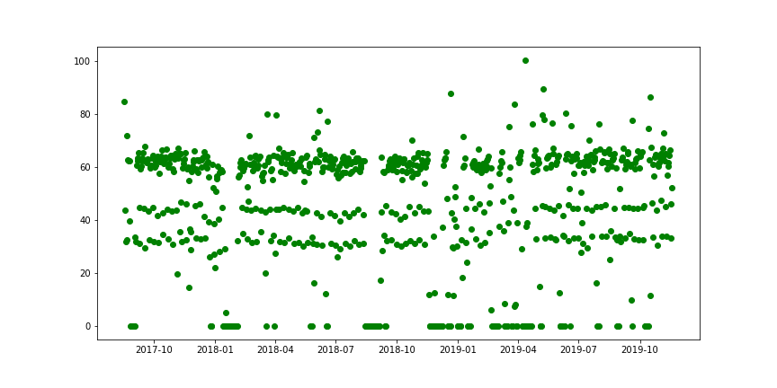
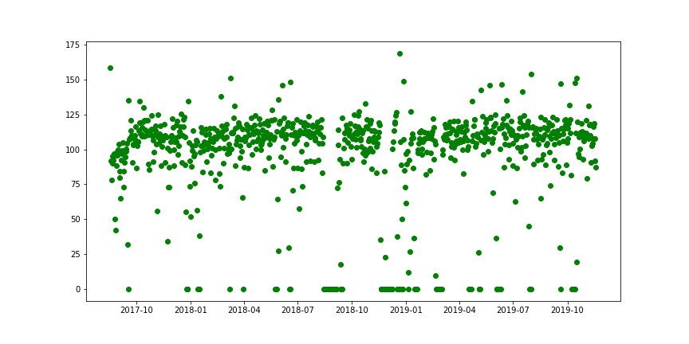
</center>

Il existe une deuxième catégorie de routes pour lesquelles il y a soudainement une irrégularité brutale et prolongée dans la prise de relevé.

<center>
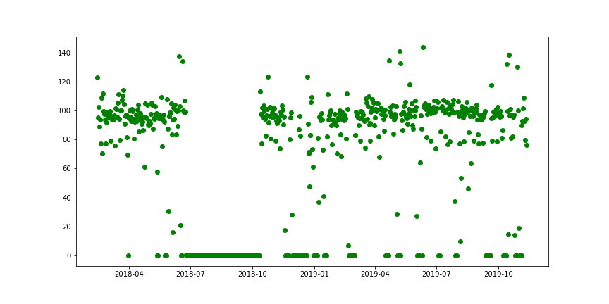
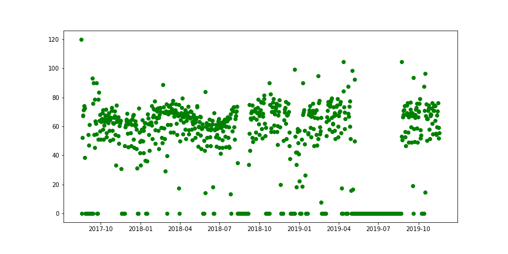
</center>

Enfin, nous avons remarqué une dernière catégorie, pour laquelle les relevés de traffic sont quasi-inexistant :

<center>
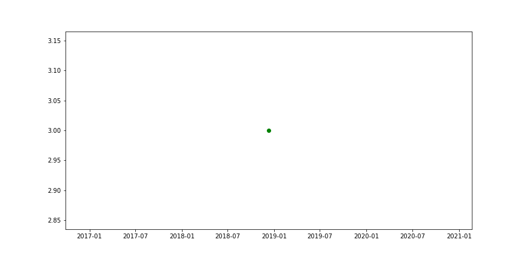
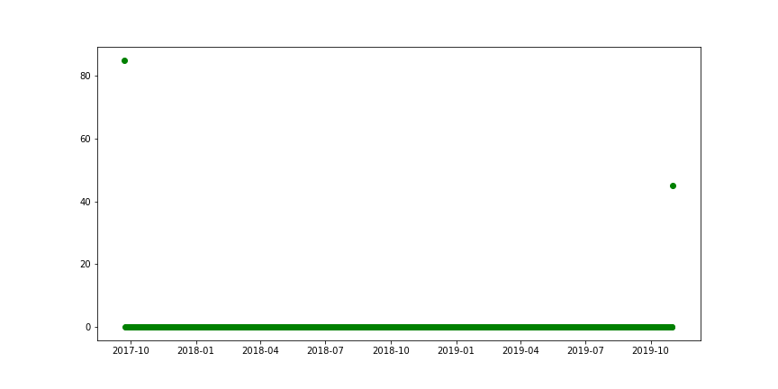
</center>

Nous faisons donc le choix de laisser tomber les routes pour lesquelles le nombre de relevés est beaucoup trop faible.

Voici une courte visualisation de la taille des relevés par route :

<center>
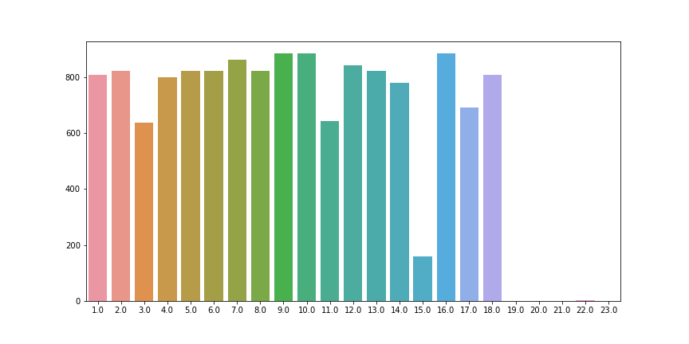
</center>

Nous remarquons alors que la 15e route est aussi relativement maigre en données, nous décidons donc de la sortir aussi de notre base d'entrainement.

Au total, nous notons **17 routes** pour lesquelles les relevés sont relativement corrects.

Pour la première et seconde catégorie, nous décidons donc de compléter naivement les périodes de relevés manquante et extrapolant sur le trafic des jours précédents. Pour être certains de compléter ces trous de manière relativement cohérente, nous avons réfléchi à différentes méthodes. Celle qui nous paraissait la plus pertinente était de prendre le trafic de la semaine précédente au même jour, moyenné par le traffic du jour précédent.

Il faut d'abord identifier les jours pour lesquels il n'y a pas de données et compléter ces jours par la moyenne citée précédemment, cela demande un traitement sur les données complexe mais essentiel. Une fois ce traitement fait, nous pourrons enfin passer à l'entrainement de notre modèle.

## 2. Entrainement du réseau

### 2.1 Résultat de l'augmentation du jeu de données

Voici deux exemples d'augmentation du jeu de données que nous avons pu réaliser :

<center>

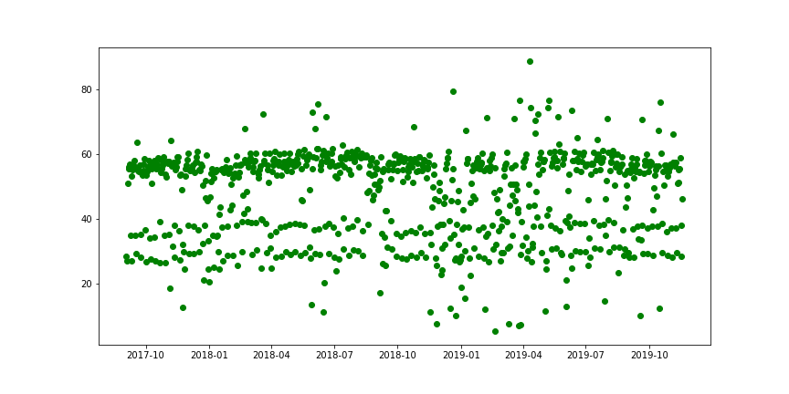
</center>

<center>

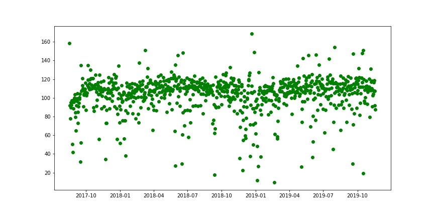
</center>


Cette augmentation de données était essentielle pour réaliser notre entrainement. À partir de celle-ci nous pouvons implémenter une sliding window afin d'étudier l'évolution du traffic au cours du temps.

### 2.2 Méthode de la sliding window 

Après plusieurs entrainements et l'optimisation de certains paramètres, nous obtenons les résultats suivants concernant les différentes tailles de sliding window (en jours), pour un nombre d'epochs de 2 uniquement (car le réseau converge très rapidement).

| Sliding Window | Error |
| ----------- | ----------- |
| 7 | 0.173 |
| 30 | 0.183 |
| 60 | 0.183 |
| 120 | 0.194 |

Pour un nombre d'epoch de 10 cette fois-ci nous gagnons sensiblement en précision :

| Sliding Window | Error |
| ----------- | ----------- |
| 60 | 0.167 |
| 120 | 0.163 |

### 2.3 Interprétation des résultats

Voici l'évolution du loss de l'entrainement de notre réseau, nous remarquons que le réseau converge très rapidement vers la solution avant d'affiner ses résultats très lentement. Pour cela, il a fallu chercher des paramètres optimaux en termes de sliding window, de nombre d'epochs et de learning rate. Nous obtenons donc un **taux d'erreur final d'environ 17%**.

```
sliding_window = 120
learning_rate = 0.001
num_epochs = 10
``` 

<center>
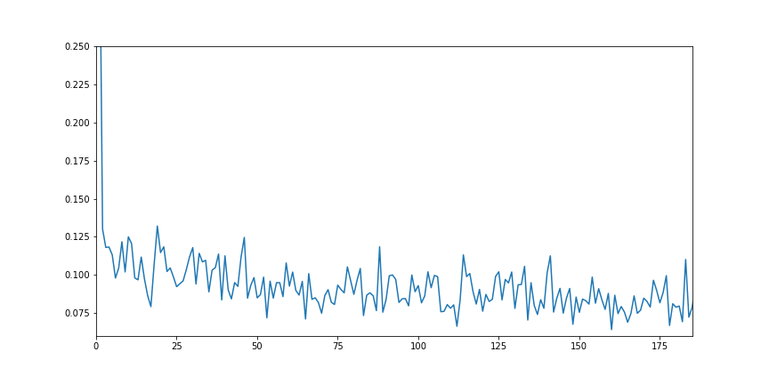
</center>

Ces résultats sont très intéréssants car, avec nos données augmentées, nous estimons à **24% le taux d'erreur que nous aurions fait** en prenant simplement une **moyenne** des valeurs sur la sliding window pour prédire la dernière. Cela montre que notre réseau s'est entrainer de manière plus complète pour prédire la valeur de sortie.

## Conclusion

En conclusion, nous sommes relativement satisfaits des résultats que nous avons obtenus. La selection et le choix de l'augmentation des données sont les optimisations qui nous ont pris le plus de temps à implémenter. Nous pourrions désormais imaginer utiliser notre réseau retrospectivement pour augmenter nos données a posteriori, ce serait une étude intéréssante à mener, bien que nous n'ayons pas eu le temps de la réaliser.

## References
<a id="1">[1]</a>
Michael Waskom and the seaborn development team.
dec 2020,
https://seaborn.pydata.org/

<a id="2">[2]</a>
PyTorch: An Imperative Style, High-Performance Deep Learning Library.
Paszke, Adam and Gross, Sam and Chintala, Soumith and Chanan, Gregory and Yang, Edward and DeVito, Zachary and Lin, Zeming and Desmaison, Alban and Antiga, Luca and Lerer, Adam. 2017. https://pytorch.org/docs/stable/index.html